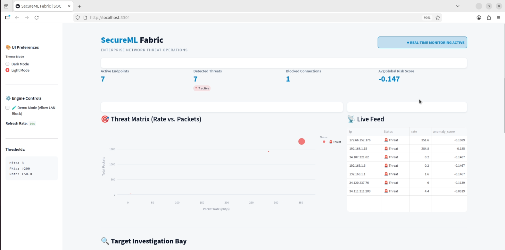
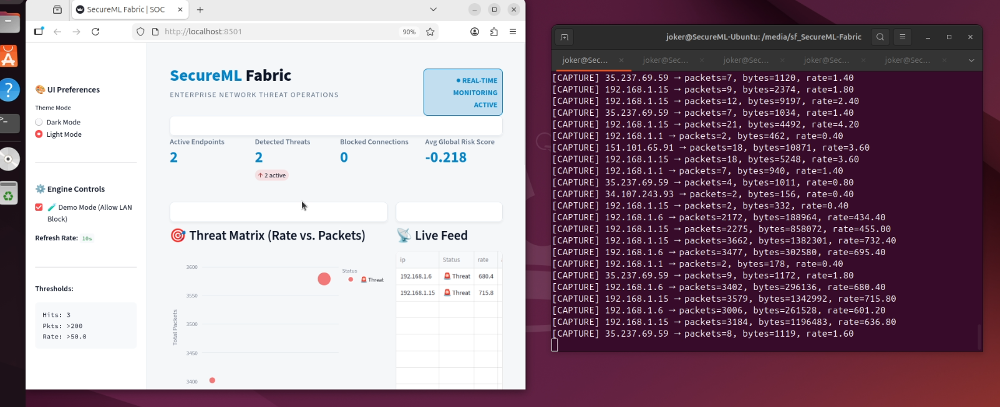
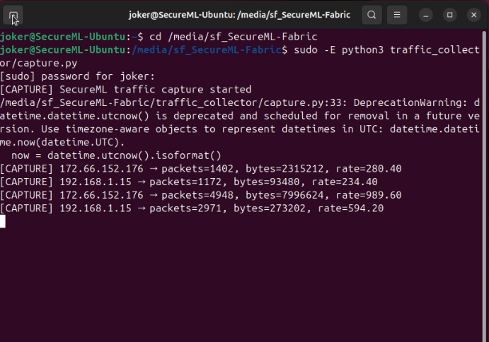
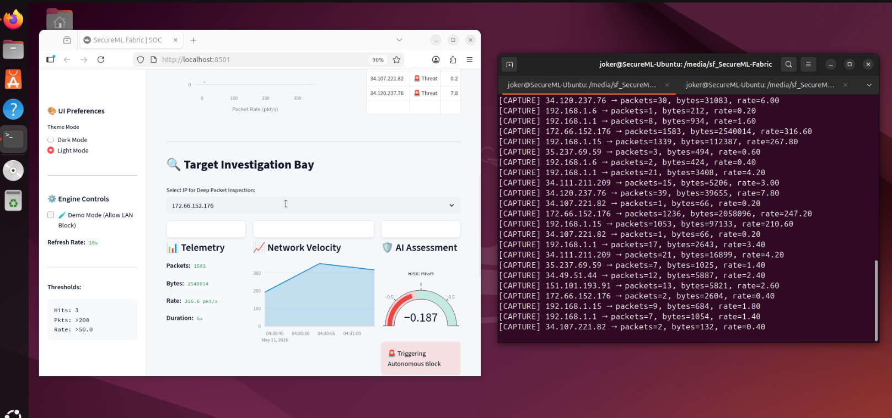
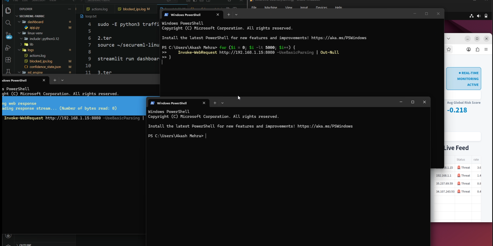
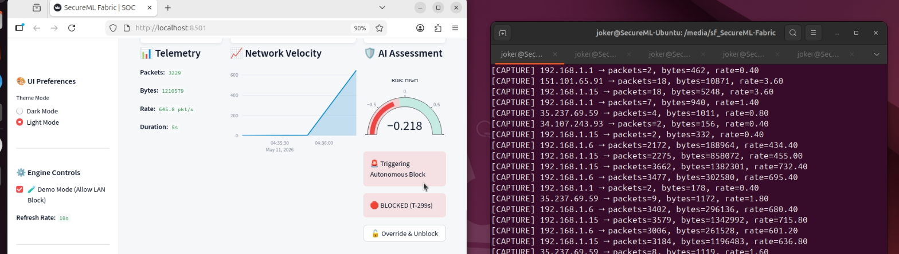
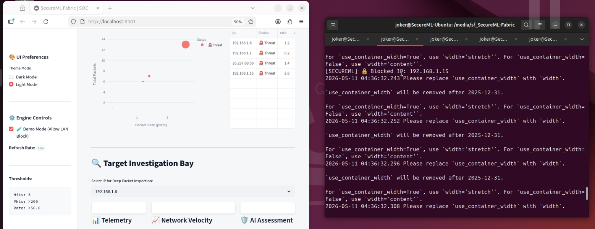
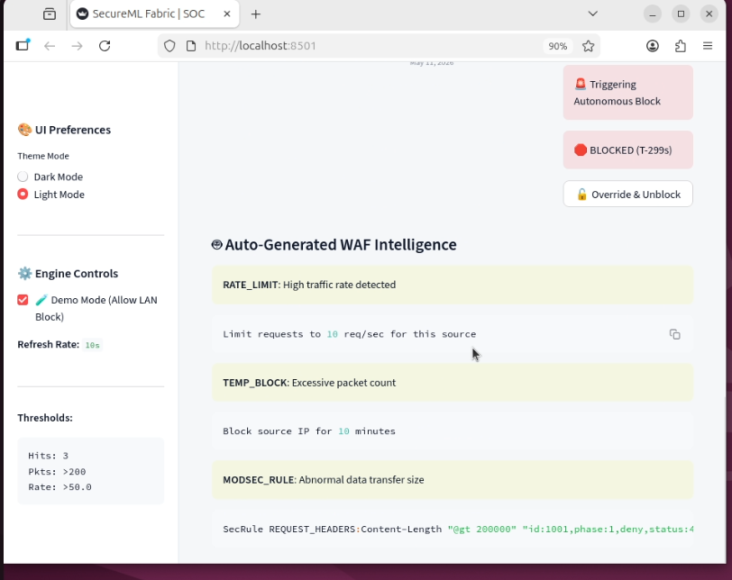
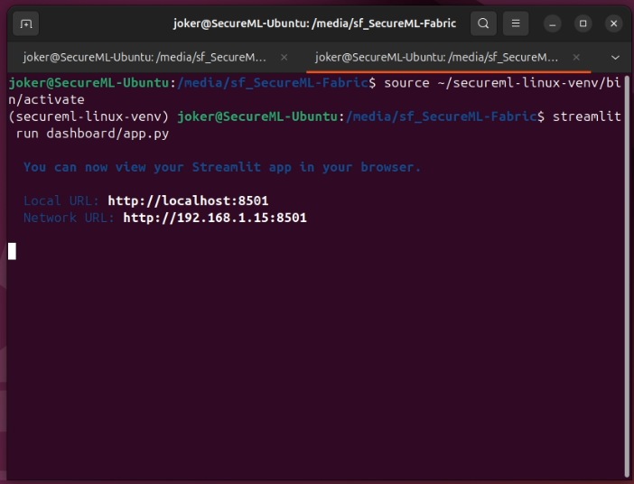

# 🔐 SecureML Fabric

### AI-Powered Network Threat Detection & Autonomous Response System

SecureML Fabric is an intelligent cybersecurity platform designed to monitor live network traffic, detect anomalies using Machine Learning, and autonomously respond to suspicious activities through intelligent IP blocking and dynamic WAF rule generation.

The platform combines:

- 📡 Real-time traffic monitoring
- 🤖 Machine Learning anomaly detection
- 🛡️ Autonomous response system
- 🔥 WAF intelligence generation
- 📊 Interactive SOC dashboard
- ⚡ Live threat visualization

--- 

# 🚀 Features

✅ Real-Time Packet Monitoring  
✅ AI-Based Threat Detection  
✅ Autonomous IP Blocking  
✅ Dynamic WAF Rule Generation  
✅ Interactive SOC Dashboard  
✅ Threat Confidence Analysis  
✅ Packet Rate & Traffic Analysis  
✅ Light/Dark Theme Support  
✅ Live Threat Visualization  
✅ Real-Time Response Engine

---

# 🏗️ System Workflow

```text
Network Traffic
       │
       ▼
Traffic Capture Engine
       │
       ▼
Feature Extraction
       │
       ▼
ML Anomaly Detection
       │
 ┌─────┴─────┐
 ▼           ▼
Threat      Normal
Detected    Traffic
 ▼
Response Engine
 ▼
IP Blocking + WAF Intelligence
 ▼
SOC Dashboard Visualization
```

---

# 📂 Project Structure

```bash
SECUREML-FABRIC/
│
├── dashboard/
│   └── app.py
│
├── Interface/
│   ├── Anomoly.png
│   ├── Call_Dash.png
│   ├── Capture_ips.png
│   ├── Dash.png
│   ├── Hiest.png
│   ├── IP_Blocked.png
│   ├── Monitoring.png
│   ├── System_blocking.png
│   └── WAF_intel.png
│
├── logs/
│   ├── actions.log
│   ├── blocked_ips.log
│   └── confidence_state.json
│
├── ml_engine/
│   ├── baseline_model.pkl
│   ├── detect_anomaly.py
│   ├── explain.py
│   ├── live_traffic.csv
│   ├── sample_data.py
│   ├── traffic_data.csv
│   └── train_baseline.py
│
├── rule_engine/
│   ├── confidence.py
│   ├── response_engine.py
│   └── rule_generator.py
│
├── traffic_collector/
│   └── capture.py
│
└── README.md
```

---

# 🖥️ SOC Dashboard

The SecureML Fabric dashboard provides a centralized Security Operations Center (SOC) interface for monitoring live traffic, analyzing anomalies, and visualizing threat activity in real time.



---

# 🌍 Live Threat Monitoring

The monitoring engine continuously captures and analyzes live network activity to identify suspicious traffic patterns.



---

# 📡 Packet Capture Engine

The packet capture engine extracts real-time telemetry data including:

- Packet count
- Byte transfer
- Traffic rate
- Connection duration



---

# 🎯 Threat Matrix Visualization

The Threat Matrix visualizes suspicious network behavior based on packet rate and packet volume.

The larger and more abnormal the traffic pattern, the higher the risk score generated by the ML engine.



---

# 🧠 AI Investigation Bay

The Investigation Bay performs deep traffic analysis for selected IP addresses.

Features include:

- 📊 Telemetry Analysis
- 📈 Network Velocity Tracking
- 🛡️ AI Threat Assessment
- ⚠️ Risk Confidence Meter



---

# 🚫 Autonomous Blocking System

When malicious traffic exceeds predefined thresholds, SecureML Fabric automatically triggers defensive actions.

Blocking conditions include:

- High packet rate
- Repeated anomaly detection
- Suspicious traffic patterns
- Elevated ML risk score



---

# 🔒 Dynamic IP Blocking

The response engine can automatically isolate suspicious IP addresses and temporarily block malicious communication.

Additional capabilities:

- Manual override
- Real-time block tracking
- Temporary ban expiration



---

# 🛡️ AI-Generated WAF Intelligence

SecureML Fabric dynamically generates WAF protection recommendations based on detected attack behavior.

Generated rules include:

- Rate limiting
- Temporary blocks
- ModSecurity rules
- Payload inspection rules



---

# ⚙️ Dashboard Deployment

The SOC dashboard runs using Streamlit and visualizes network intelligence in real time.



---

# 🤖 Machine Learning Engine

The ML model analyzes traffic features such as:

| Feature  | Description           |
| -------- | --------------------- |
| Duration | Connection duration   |
| Packets  | Number of packets     |
| Bytes    | Data transfer volume  |
| Rate     | Packet transfer speed |

The system classifies traffic into:

- ✅ Normal Traffic
- 🚨 Threat / Anomaly

---

# 🛠️ Technologies Used

| Technology       | Purpose           |
| ---------------- | ----------------- |
| Python           | Core Backend      |
| Streamlit        | Dashboard         |
| Plotly           | Visualization     |
| Pandas           | Data Processing   |
| Scikit-Learn     | Machine Learning  |
| Joblib           | Model Loading     |
| Linux Networking | Packet Capture    |
| WAF Rules        | Threat Mitigation |

---

# ⚡ Installation

## 1️⃣ Clone Repository

```bash
git clone https://github.com/itsakki10/SecureML-Fabric.git
cd SecureML-Fabric
```

---

## 2️⃣ Create Virtual Environment

```bash
python3 -m venv secureml-linux-venv
source secureml-linux-venv/bin/activate
```

---

## 3️⃣ Install Requirements

```bash
pip install -r requirements.txt
```

---

## 4️⃣ Start Traffic Capture

```bash
sudo -E python3 traffic_collector/capture.py
```

---

## 5️⃣ Launch Dashboard

```bash
streamlit run dashboard/app.py
```

---

# 🌐 Dashboard Access

```text
Local:
http://localhost:8501

Network:
http://<your-ip>:8501
```

---

# 🔥 Future Improvements

- 🌍 GeoIP Threat Mapping
- 🧠 Deep Learning Detection Models
- ☁️ Cloud Threat Intelligence
- 🛰️ SIEM Integration
- 📈 Advanced Threat Analytics
- 📨 Email & Telegram Alerts
- 🌐 Global Threat Heatmaps

---

# 📚 Research Areas

This project is inspired by research in:

- Intrusion Detection Systems
- AI-Based Cybersecurity
- Network Traffic Analysis
- Adaptive Security Systems
- WAF Automation
- Autonomous Cyber Defense

---

# 👨‍💻 Developer

## Akash Mehra

AI & Cybersecurity Enthusiast  
Full Stack Developer | ML Security Researcher

---

# ⭐ Conclusion

SecureML Fabric demonstrates how Artificial Intelligence and Machine Learning can be integrated with cybersecurity systems to create an adaptive and autonomous defense platform capable of:

- Monitoring network traffic
- Detecting anomalies
- Generating threat intelligence
- Blocking malicious activity
- Assisting security operations in real time

---
